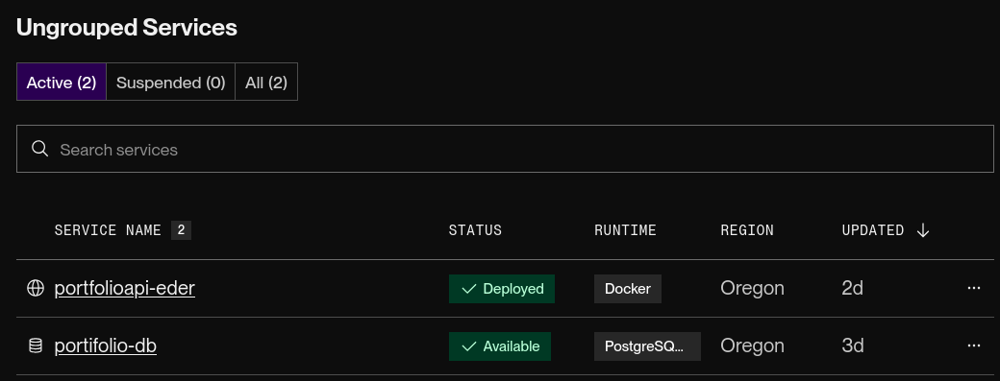

# Portfólio API - Back-End (Java & Spring Boot)

Esta é a API RESTful escalável e de alto desempenho responsável pelo fornecimento dinâmico de dados para o ecossistema do meu portfólio profissional (perfil, projetos, competências e certificados). O sistema está empacotado em ambientes de execução isolados.

> [!NOTE]
> O delay é devido ao serviço ser gratuito, mas atendendo ao objetivo do projeto

## Links:
* Endereço do endpoint oficial do ecossistema:
**https://onrender.com**
* Endereço do frontend Angular:
**https://github.com/EderLima88/portfolio-angular.git**
* Endereço do código deste projeto
**https://github.com/EderLima88/portfolioapi-backend.git**

---

## Stack Tecnológica & Infraestrutura
*   **Java 17 & Spring Boot 3** - Núcleo de desenvolvimento da API utilizando padrões MVC corporativos.
*   **Spring Data JPA / Hibernate** - Camada robusta de abstração de dados e mapeamento objeto-relacional.
*   **PostgreSQL** - Banco de dados relacional robusto integrado na nuvem através de conexões criptografadas (SSL).
*   **Containerização com Docker** - Criação de imagens leves baseadas em Alpine Linux.

---

## Soluções de Engenharia Aplicadas

### 1. Persistência Automatizada com Autocura (Resiliência de Dados)
Como os servidores de nuvem gratuitos entram em hibernação profunda após períodos de inatividade, os dados temporários poderiam sofrer corrupção ou travamento de ponteiros de chaves estrangeiras na reinicialização.
*   **Solução:** Configuramos a propriedade `ddl-auto: create` no `application.yml` integrada à classe **`DatabaseSeeder.java`**. Toda vez que o servidor acorda, o Hibernate limpa os dados legados do PostgreSQL e reinsere a lista atualizada com meus 6 projetos e certificados indexados do Google Drive, garantindo consistência absoluta do ecossistema a cada boot.

### 2. Quebra da Barreira de Segurança de Origem Cruzada (Mapeamento CORS)
`@CrossOrigin("*")` abre um canal seguro de tráfego de dados na camada HTTP, permitindo que o front-end em Angular consuma o JSON sem sofrer bloqueios no navegador.

### 3. Containerização Docker Slim (Alpine Linux)
Arquivo `Dockerfile` baseado em uma imagem ultra-reduzida do **Alpine Linux**. Runtime do Java 17, as dependências do Maven e os pacotes do Spring Boot em uma camada imutável.

---

##  Fluxo de Trabalho e Deploy Automático
O projeto está hospedado nos servidores do **Render.com**. A plataforma está conectada diretamente a este repositório Git e configurada com gatilhos inteligentes na branch **`master`**.

*O Render detecta o sinal de push na mesma hora, reconstrói o container Docker de forma automatizada e atualiza o banco de dados na nuvem em menos de 3 minutos. A demora é devido so serviço ser gratuito, mas atendendo ao objetivo do projeto*

Desenvolvido por **Éder de Lima** 🎓 *Graduado em Análise e Desenvolvimento de Sistemas e Engenharia de Software*. *Pós-graduado em Desenvolvimento de Sistema com Java e Ciência de Dados.*